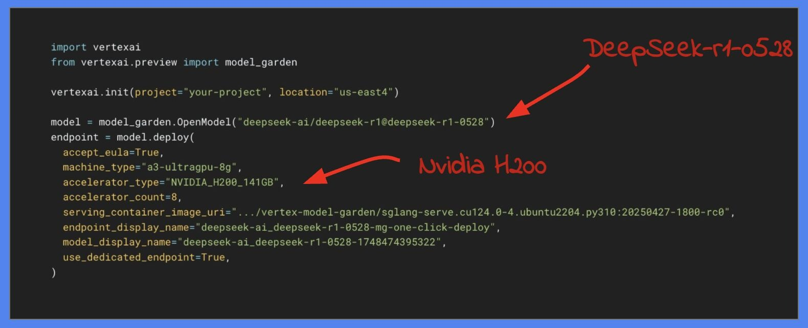

# DeepSeek lab

```sh
python -m venv venv
source venv/bin/activate

pip install torch torchvision torchaudio --index-url https://download.pytorch.org/whl/cu118
pip install -r requirements.txt

python download_model.py
```


### Run DeepSeek with Ollama in Local
```sh
curl -fsSL https://ollama.com/install.sh | sh
ollama run deepseek-r1:8b

python ollama_app.py
```

### Run DeepSeek with Ollama in Cloud
```sh
# Build and publish image
gcloud builds submit --tag us-east1-docker.pkg.dev/project-1-test-ai/cloud-run-source-deploy/ollama --machine-type e2-highcpu-32

# Deploy the service
gcloud run services replace ollama-deploy.yaml

# Load the Deepseek model
curl --location 'https://ollama-570351480416.us-central1.run.app/api/pull' \
--header 'Content-Type: application/json' \
--data '{
    "name": "deepseek-r1:8b",
    "stream": true
}'

# Let's test it
curl --location 'https://ollama-570351480416.us-central1.run.app/api/chat' --header 'Content-Type: application/json' --data '{
    "model": "deepseek-r1:8b",
    "messages": [
        {
            "role": "system",
            "content": "You are an assistant that helps people"
        },
        {
            "role": "user",
            "content": "What are the advantages of deploying my own LLM?"                                                          }
    ],
    "stream": false
}'
```

### Deploy DeepSeek with Google Cloud
```
import vertexai
from vertexai.preview import model_garden

vertexai.init(project="project-1-test-ai", location="us-central1")

model = model_garden.OpenModel("deepseek-ai/deepseek-r1@deepseek-r1-distill-llama-8b")
endpoint = model.deploy(
  accept_eula=True,
  machine_type="g2-standard-24",
  accelerator_type="NVIDIA_L4",
  accelerator_count=2,
  serving_container_image_uri="us-docker.pkg.dev/deeplearning-platform-release/vertex-model-garden/vllm-inference.cu121.0-6.ubuntu2204.py310",
  endpoint_display_name="deepseek-ai_deepseek-r1-distill-llama-8b-mg-one-click-deploy",
  model_display_name="deepseek-ai_deepseek-r1-distill-llama-8b-1748716110143",
  fast_tryout_enabled=True,
)
```



### References
- https://github.com/deepseek-ai/DeepSeek-V3
- https://github.com/khanfar/DeepSeek-V3-Windows-Installation-Guide
- https://ollama.com/library/deepseek-r1
- https://www.analyticsvidhya.com/blog/2025/01/run-deepseek-models-locally/
- Ollama API: https://www.postman.com/postman-student-programs/ollama-api/collection/suc47x8/ollama-rest-api?action=share&source=copy-link&creator=41346167

